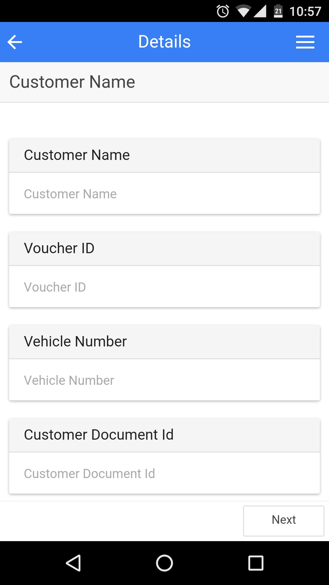
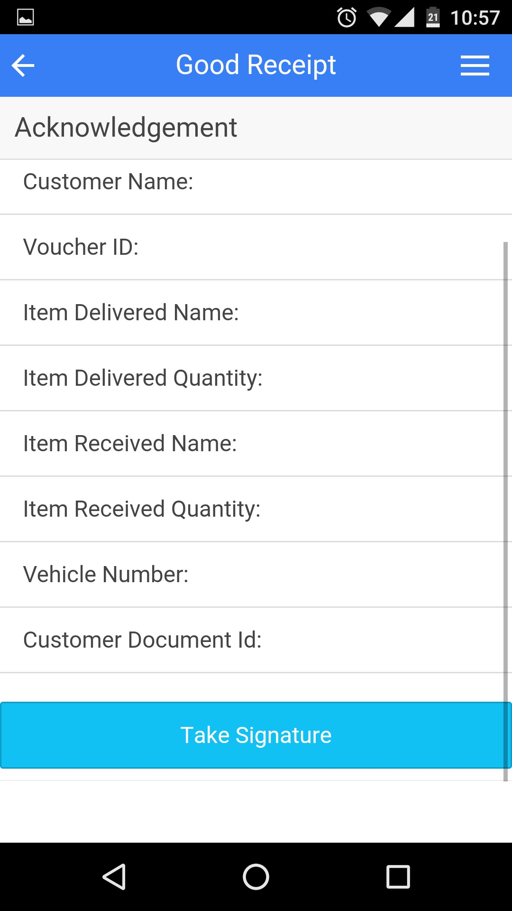
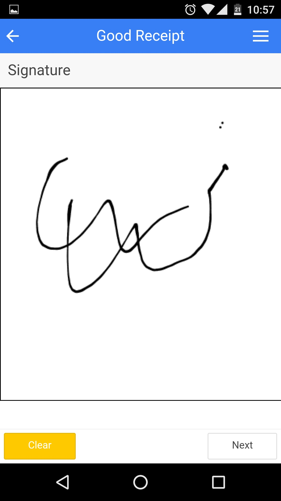

## Logitronics

An Android application is developed to keep the track on cylinder deliveries made by the company employees.

------

#### Features

- User authentication from company server
- All deliveries are synced with company server in real-time
- Allow employee take signature of recipient when delivery is confirmed
- Resulted 30% increase in delivery efficiency of company
- Support 2 languages Hindi and English

------

#### Technologies Used

[Ionic Framework@1.2.1](https://ionicframework.com/), [AngularJS@1.4.3](https://angularjs.org/), [Apache Cordova](https://cordova.apache.org/)

------

#### Screenshots

|  |  |  |
| :----------------------------------------------------------: | :----------------------------------------------------------: | :----------------------------------------------------------: |
|                        **Input Form**                        |                         **Receipt**                          |                        **Signature**                         |